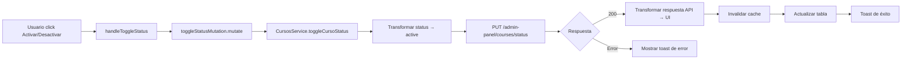

# ✅ ACTUALIZACIÓN: Endpoint PUT - Activar/Desactivar Curso

## 🔄 CAMBIO REALIZADO

### **ANTES:**
```
PATCH /api/v1/courses/{id}/toggle-status
```
Path parameter: `id` en la URL

### **AHORA:**
```
PUT /api/v1/admin-panel/courses/status
```
Body parameter: `course_id` en el body

---

## 📋 DIFERENCIAS CLAVE

### **1. Método HTTP:**

**ANTES:**
```
PATCH /api/v1/courses/123e4567-e89b-12d3-a456-426614174000/toggle-status
```

**AHORA:**
```
PUT /api/v1/admin-panel/courses/status
```

### **2. Estructura del Body:**

**ANTES:**
```json
{
  "status": "Activo"
}
```

**AHORA:**
```json
{
  "course_id": "123e4567-e89b-12d3-a456-426614174000",
  "active": true
}
```

### **3. Transformación de Datos:**

**ANTES:**
- Enviaba `status` como string ("Activo" o "Inactivo")

**AHORA:**
- Envía `course_id` como string (UUID)
- Envía `active` como boolean (true/false)

---

## 🔄 TRANSFORMACIÓN AUTOMÁTICA

### **Desde el UI → API:**

| Campo UI | Tipo UI | → | Campo API | Tipo API |
|----------|---------|---|-----------|----------|
| `id` | string | → | `course_id` | string |
| `status: "Activo"` | string | → | `active` | **true** |
| `status: "Inactivo"` | string | → | `active` | **false** |

### **Código de Transformación:**

```typescript
// Convertir status a boolean para la API
const active = status === "Activo";

const requestBody = {
  course_id: id,
  active: active
};
```

---

## 📊 ARCHIVOS MODIFICADOS

### **1. Servicio de API** ✅
**Archivo:** `src/lib/services/cursos-service.ts`

**Cambios:**
- ✅ Endpoint: `/api/v1/admin-panel/courses/status`
- ✅ Método: `PUT` (antes era `PATCH`)
- ✅ Body: `{ course_id, active }` (antes era `{ status }`)
- ✅ Transformación: `status` → `active` boolean
- ✅ Logs detallados

### **2. Documentación** ✅
**Archivo:** `ENDPOINTS_CURSOS_COMPLETOS.md`

**Cambios:**
- ✅ Endpoint actualizado
- ✅ Método actualizado
- ✅ Estructura del body actualizada
- ✅ Nota sobre transformación automática

---

## 🧪 CÓMO PROBAR

### **Paso 1: Refresca el navegador**
```
F5 o Ctrl + R
```

### **Paso 2: Cambia el estado de un curso**
1. Ve a `/dashboard/cursos`
2. Click en el menú (⋮) de un curso
3. Click en "Activar" o "Desactivar"

### **Paso 3: Verifica en la consola**
Deberías ver:
```
🔄 CursosService: Cambiando estado del curso: 123e4567-... a Activo
📤 CursosService: Datos enviados a la API: {
  course_id: "123e4567-e89b-12d3-a456-426614174000",
  active: true
}
🌐 CursosService: Haciendo petición a: https://squatfit-api-cyrc2g3zra-no.a.run.app/api/v1/admin-panel/courses/status
📦 CursosService: Respuesta de la API: {...}
✅ CursosService: Estado del curso actualizado
```

---

## 🎯 EJEMPLO COMPLETO

### **Ejemplo de Petición:**

```bash
PUT https://squatfit-api-cyrc2g3zra-no.a.run.app/api/v1/admin-panel/courses/status

Headers:
  Content-Type: application/json
  Authorization: Bearer {tu_token}

Body:
{
  "course_id": "123e4567-e89b-12d3-a456-426614174000",
  "active": true
}
```

### **Ejemplo de Respuesta:**

**⚠️ IMPORTANTE:** La API **NO devuelve el curso completo**, solo un mensaje de confirmación:

```json
{
  "message": "Curso activado exitosamente"
}
```

O en caso de desactivar:

```json
{
  "message": "Curso desactivado exitosamente"
}
```

---

## ✅ VENTAJAS DEL NUEVO ENDPOINT

### **1. Consistencia con otros endpoints:**
- Mismo endpoint base: `/api/v1/admin-panel/courses`
- Mismo método: `PUT`
- Estructura similar de body

### **2. Más explícito:**
- `course_id` claramente indica qué curso modificar
- `active` boolean es más claro que string

### **3. Mejor para APIs RESTful:**
- Un solo endpoint para cambiar estado
- No necesita path parameters

---

## 🎯 RESULTADOS POSIBLES

### **✅ Éxito (200):**
```
✅ CursosService: Estado del curso actualizado
Toast: "Curso '{nombre}' {activado/desactivado}."
```
- El estado se actualiza en la tabla
- El badge de estado cambia de color
- Las estadísticas se actualizan si es necesario

### **❌ Error - Curso no encontrado (404):**
```json
{
  "error": "Not Found",
  "message": "Curso con ID '...' no encontrado"
}
```

### **❌ Error - course_id inválido:**
```json
{
  "error": "Bad Request",
  "message": "El campo 'course_id' debe ser un UUID válido"
}
```

### **❌ Error - active inválido:**
```json
{
  "error": "Validation Error",
  "message": "El campo 'active' debe ser un boolean"
}
```

---

## 🔍 LOGS PARA DEBUGGING

He agregado logs detallados en cada paso:

### **1. Inicio del cambio:**
```
🔄 CursosService: Cambiando estado del curso: {id} a {status}
```

### **2. Datos transformados:**
```
📤 CursosService: Datos enviados a la API: {
  course_id: "...",
  active: true/false
}
```

### **3. URL de la petición:**
```
🌐 CursosService: Haciendo petición a: https://.../courses/status
```

### **4. Respuesta de la API:**
```
📦 CursosService: Respuesta de la API: {...}
```

### **5. Éxito:**
```
✅ CursosService: Estado del curso actualizado
```

---

## ⚠️ NOTAS IMPORTANTES

### **1. Transformación de Status:**
```typescript
// UI usa strings
status: "Activo" | "Inactivo"

// API usa boolean
active: true | false

// Transformación automática
const active = status === "Activo";
```

### **2. Validación del Backend:**
El backend validará:
- Que el `course_id` sea un UUID válido
- Que el `course_id` exista en la base de datos
- Que el `active` sea un boolean

### **3. Respuesta:**
La API devuelve el curso completo actualizado, no solo el estado.

---

## 🔄 FLUJO COMPLETO



---

## ✅ ESTADO ACTUAL DE ENDPOINTS

| # | Método | Endpoint | Estado |
|---|--------|----------|--------|
| 1 | `GET` | `/api/v1/admin-panel/courses` | ✅ CONFIRMADO |
| 2 | `POST` | `/api/v1/admin-panel/courses` | ✅ CONFIRMADO |
| 3 | `PUT` | `/api/v1/admin-panel/courses?course_id={id}` | ✅ CONFIRMADO |
| 4 | `PUT` | `/api/v1/admin-panel/courses/status` | ✅ ACTUALIZADO |
| 5 | `GET` | `/api/v1/courses/{id}` | ⚠️ Pendiente |
| 6 | `DELETE` | `/api/v1/courses/{id}` | ⚠️ Pendiente |

---

## 📝 PRÓXIMOS PASOS

1. **Probar cambio de estado:**
   - Refresca el navegador
   - Activa/desactiva un curso
   - Verifica los logs
   - Confirma que funciona

2. **Actualizar endpoints restantes:**
   - DELETE (eliminar curso)
   - GET por ID (si es necesario)

3. **Implementar selector de tutores:**
   - Para usar `tutor_id` real
   - Mejorar UX del formulario

---

**¡El endpoint PUT para activar/desactivar ha sido actualizado exitosamente!** 🎉

**Refresca el navegador y prueba cambiar el estado de un curso. Revisa los logs en la consola para ver el flujo completo.**
