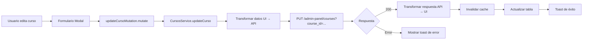

# ✅ ACTUALIZACIÓN: Endpoint PUT - Actualizar Curso

## 🔄 CAMBIO REALIZADO

### **ANTES:**
```
PUT /api/v1/courses/{id}
```
Path parameter: `id` en la URL

### **AHORA:**
```
PUT /api/v1/admin-panel/courses?course_id={id}
```
Query parameter: `course_id` como parámetro de consulta

---

## 📋 DIFERENCIAS CLAVE

### **1. Tipo de Parámetro:**

**ANTES (Path Parameter):**
```
PUT /api/v1/courses/123e4567-e89b-12d3-a456-426614174000
```

**AHORA (Query Parameter):**
```
PUT /api/v1/admin-panel/courses?course_id=123e4567-e89b-12d3-a456-426614174000
```

### **2. Estructura del Body:**

**Formato de la API (igual que CREATE):**
```json
{
  "title": "Curso de Fitness Avanzado",
  "subtitle": "Aprende técnicas avanzadas de entrenamiento",
  "price": "49.99",
  "tutor_id": "123e4567-e89b-12d3-a456-426614174000",
  "image": "https://storage.googleapis.com/course-images/image.jpg",
  "video_presentation": "https://storage.googleapis.com/course-videos/presentation.mp4"
}
```

> **Nota:** Todos los campos son opcionales. Solo envía los que quieres actualizar.

---

## 🔄 TRANSFORMACIÓN AUTOMÁTICA

### **Desde el Formulario (UI) → API:**

| Campo UI | Tipo UI | → | Campo API | Tipo API |
|----------|---------|---|-----------|----------|
| `name` | string | → | `title` | string |
| `description` | string | → | `subtitle` | string |
| `price` | **number** | → | `price` | **string** |
| `instructor` | string | → | `tutor_id` | string |

### **Código de Transformación:**

```typescript
// Solo transforma los campos que se proporcionan (partial update)
const apiData: Partial<CreateCursoApiDto> = {};

if (data.name) apiData.title = data.name;
if (data.description) apiData.subtitle = data.description;
if (data.price !== undefined) apiData.price = data.price.toString();
if (data.instructor) apiData.tutor_id = data.instructor;
```

---

## 📊 ARCHIVOS MODIFICADOS

### **1. Servicio de API** ✅
**Archivo:** `src/lib/services/cursos-service.ts`

**Cambios:**
- ✅ Endpoint actualizado: `/api/v1/admin-panel/courses?course_id={id}`
- ✅ Query parameter en lugar de path parameter
- ✅ Transformación parcial de datos (solo campos proporcionados)
- ✅ Logs detallados de datos enviados y respuesta
- ✅ Manejo flexible de respuesta

### **2. Documentación** ✅
**Archivo:** `ENDPOINTS_CURSOS_COMPLETOS.md`

**Cambios:**
- ✅ Endpoint actualizado
- ✅ Query parameter documentado
- ✅ Estructura del body actualizada
- ✅ Nota sobre transformación automática

---

## 🧪 CÓMO PROBAR

### **Paso 1: Refresca el navegador**
```
F5 o Ctrl + R
```

### **Paso 2: Edita un curso**
1. Ve a `/dashboard/cursos`
2. Click en el menú (⋮) de un curso
3. Click en "Editar curso"
4. Modifica algunos campos
5. Click en "Actualizar Curso"

### **Paso 3: Verifica en la consola**
Deberías ver:
```
📝 CursosService: Actualizando curso: 123e4567-e89b-12d3-a456-426614174000
📤 CursosService: Datos enviados a la API: {
  title: "Nuevo nombre del curso",
  subtitle: "Nueva descripción",
  price: "59.99"
}
🌐 CursosService: Haciendo petición a: https://squatfit-api-cyrc2g3zra-no.a.run.app/api/v1/admin-panel/courses?course_id=123e4567-e89b-12d3-a456-426614174000
📦 CursosService: Respuesta de la API: {...}
✅ CursosService: Curso actualizado exitosamente
```

---

## 🎯 EJEMPLO COMPLETO

### **Ejemplo de Petición:**

```bash
PUT https://squatfit-api-cyrc2g3zra-no.a.run.app/api/v1/admin-panel/courses?course_id=123e4567-e89b-12d3-a456-426614174000

Headers:
  Content-Type: application/json
  Authorization: Bearer {tu_token}

Body:
{
  "title": "Curso de Fitness Avanzado",
  "subtitle": "Aprende técnicas avanzadas de entrenamiento",
  "price": "49.99",
  "tutor_id": "123e4567-e89b-12d3-a456-426614174000"
}
```

### **Ejemplo de Respuesta:**

```json
{
  "id": "123e4567-e89b-12d3-a456-426614174000",
  "title": "Curso de Fitness Avanzado",
  "subtitle": "Aprende técnicas avanzadas de entrenamiento",
  "price": "49.99",
  "tutor": {
    "id": "123e4567-e89b-12d3-a456-426614174000",
    "firstName": "Carlos",
    "lastName": "Ruiz"
  },
  "image": "https://storage.googleapis.com/course-images/image.jpg",
  "video_presentation": "https://storage.googleapis.com/course-videos/presentation.mp4",
  "students": 15
}
```

---

## ✅ VENTAJAS DEL NUEVO ENDPOINT

### **1. Consistencia con CREATE:**
- Mismo endpoint base: `/api/v1/admin-panel/courses`
- Misma estructura de body
- Misma transformación de datos

### **2. RESTful:**
- Query parameter claramente indica qué curso actualizar
- Más explícito que path parameter

### **3. Flexibilidad:**
- Solo envías los campos que quieres actualizar
- No necesitas enviar todos los campos

---

## 🎯 RESULTADOS POSIBLES

### **✅ Éxito (200):**
```
✅ CursosService: Curso actualizado exitosamente
Toast: "Curso '{nombre}' actualizado."
```
- El curso se actualiza en la tabla
- Los cambios son visibles inmediatamente
- Las estadísticas se actualizan si es necesario

### **❌ Error - Curso no encontrado (404):**
```json
{
  "error": "Not Found",
  "message": "Curso con ID '...' no encontrado"
}
```

### **❌ Error - tutor_id inválido:**
```json
{
  "error": "Bad Request",
  "message": "Tutor con ID '...' no existe"
}
```

### **❌ Error - Campos inválidos:**
```json
{
  "error": "Validation Error",
  "message": "El campo 'price' debe ser un string numérico válido"
}
```

---

## 🔍 LOGS PARA DEBUGGING

He agregado logs detallados en cada paso:

### **1. Inicio de actualización:**
```
📝 CursosService: Actualizando curso: {id}
```

### **2. Datos transformados:**
```
📤 CursosService: Datos enviados a la API: {
  title: "...",
  subtitle: "...",
  price: "...",
  tutor_id: "..."
}
```

### **3. URL de la petición:**
```
🌐 CursosService: Haciendo petición a: https://...?course_id={id}
```

### **4. Respuesta de la API:**
```
📦 CursosService: Respuesta de la API: {...}
```

### **5. Éxito:**
```
✅ CursosService: Curso actualizado exitosamente
```

---

## ⚠️ NOTAS IMPORTANTES

### **1. Actualización Parcial:**
Solo los campos que se proporcionan en el body se actualizarán. Los demás campos mantendrán su valor actual.

```typescript
// Ejemplo: Solo actualizar el precio
await CursosService.updateCurso("curso-id", {
  price: 59.99
});

// Solo se envía:
{
  "price": "59.99"
}
```

### **2. tutor_id:**
Al igual que en CREATE, actualmente se usa el nombre del instructor como `tutor_id`. Necesitas usar el ID real del tutor.

### **3. Validación del Backend:**
El backend validará:
- Que el `course_id` exista
- Que el `tutor_id` (si se proporciona) exista
- Que los campos tengan formato válido

---

## 🔄 FLUJO COMPLETO



---

## ✅ ESTADO ACTUAL DE ENDPOINTS

| # | Método | Endpoint | Estado |
|---|--------|----------|--------|
| 1 | `GET` | `/api/v1/admin-panel/courses` | ✅ CONFIRMADO |
| 2 | `POST` | `/api/v1/admin-panel/courses` | ✅ CONFIRMADO |
| 3 | `PUT` | `/api/v1/admin-panel/courses?course_id={id}` | ✅ ACTUALIZADO |
| 4 | `GET` | `/api/v1/courses/{id}` | ⚠️ Pendiente |
| 5 | `DELETE` | `/api/v1/courses/{id}` | ⚠️ Pendiente |
| 6 | `PATCH` | `/api/v1/courses/{id}/toggle-status` | ⚠️ Pendiente |

---

## 📝 PRÓXIMOS PASOS

1. **Probar actualización de curso:**
   - Refresca el navegador
   - Edita un curso
   - Verifica los logs
   - Confirma que funciona

2. **Actualizar endpoints restantes:**
   - DELETE (eliminar curso)
   - Posiblemente otros endpoints

3. **Implementar selector de tutores:**
   - Para usar `tutor_id` real
   - Mejorar UX del formulario

---

**¡El endpoint PUT ha sido actualizado exitosamente!** 🎉

**Refresca el navegador y prueba editar un curso. Revisa los logs en la consola para ver el flujo completo.**

