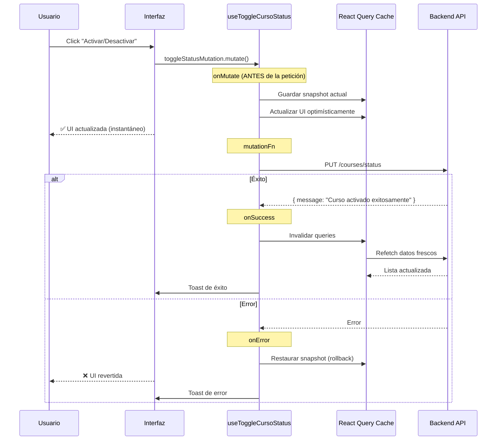

# ✅ SOLUCIÓN FINAL: Toggle Status con Optimistic Updates

## 🎯 PROBLEMA RESUELTO

### **Error Original:**
```
TypeError: Cannot read properties of undefined (reading 'firstName')
at CursosService.transformCursoFromApi
```

### **Causa Raíz:**
La API del endpoint `PUT /api/v1/admin-panel/courses/status` **NO devuelve el curso actualizado**, solo devuelve:

```json
{
  "message": "Curso activado exitosamente"
}
```

O:

```json
{
  "message": "Curso desactivado exitosamente"
}
```

Nuestro código intentaba transformar este mensaje como si fuera un curso completo → **ERROR**.

---

## ✅ SOLUCIÓN IMPLEMENTADA

### **1. Actualización del Servicio** ✅

**Archivo:** `src/lib/services/cursos-service.ts`

**ANTES:**
```typescript
static async toggleCursoStatus(
  id: string,
  status: "Activo" | "Inactivo"
): Promise<Curso> { // ❌ Esperaba un curso completo
  // ...
  const response = await this.makeRequest<any>(...);
  
  // ❌ Intentaba transformar el mensaje como curso
  const cursoData = Array.isArray(response) ? response[0] : response.data || response;
  return this.transformCursoFromApi(cursoData);
}
```

**DESPUÉS:**
```typescript
static async toggleCursoStatus(
  id: string,
  status: "Activo" | "Inactivo"
): Promise<{ message: string }> { // ✅ Ahora espera solo un mensaje
  // ...
  const response = await this.makeRequest<{ message: string }>(...);
  
  // ✅ Devuelve el mensaje tal cual
  return response; // { message: "Curso activado exitosamente" }
}
```

### **2. Actualización del Hook con Optimistic Updates** ✅

**Archivo:** `src/hooks/use-cursos.ts`

**ANTES:**
```typescript
onSuccess: (updatedCurso, { id, status }) => {
  // ❌ Intentaba usar el curso actualizado que no existe
  queryClient.setQueryData(cursosKeys.detail(id), updatedCurso);
  queryClient.invalidateQueries({ queryKey: cursosKeys.lists() });
  // ...
}
```

**DESPUÉS:**
```typescript
onMutate: async ({ id, status }) => {
  // ✅ Actualización optimista ANTES de la petición
  const previousCursos = queryClient.getQueryData<Curso[]>(cursosKeys.lists());
  
  if (previousCursos) {
    const updatedCursos = previousCursos.map((curso) =>
      curso.id === id ? { ...curso, status } : curso
    );
    queryClient.setQueryData(cursosKeys.lists(), updatedCursos);
  }
  
  return { previousCursos, id };
},
onSuccess: (response, { id, status }) => {
  // ✅ Solo invalida queries para sincronizar
  queryClient.invalidateQueries({ queryKey: cursosKeys.lists() });
  
  const action = status === "Activo" ? "activado" : "desactivado";
  toast.success(`Curso ${action} exitosamente`, { id: `toggle-curso-${id}` });
  
  console.log("📨 Respuesta del servidor:", response.message);
},
onError: (error: Error, { id }, context) => {
  // ✅ Rollback si hay error
  if (context?.previousCursos) {
    queryClient.setQueryData(cursosKeys.lists(), context.previousCursos);
  }
  // ...
}
```

---

## 🔄 CÓMO FUNCIONA AHORA (Optimistic Updates)

### **Flujo Completo:**



### **Ventajas de Optimistic Updates:**

1. **UX Instantánea** ⚡
   - El usuario ve el cambio **inmediatamente**
   - No espera la respuesta del servidor

2. **Sincronización Automática** 🔄
   - Al invalidar queries, React Query refetch automáticamente
   - La UI se sincroniza con el servidor

3. **Rollback Automático** ↩️
   - Si hay error, se revierte al estado anterior
   - El usuario ve un mensaje de error

4. **No Requiere Datos del Servidor** 📦
   - No importa que la API solo devuelva un mensaje
   - Usamos los datos que ya tenemos en cache

---

## 📊 ARCHIVOS MODIFICADOS

### **1. Servicio de API** ✅
**Archivo:** `src/lib/services/cursos-service.ts`

**Cambios:**
- ✅ Tipo de retorno: `Promise<{ message: string }>`
- ✅ Ya no intenta transformar el mensaje como curso
- ✅ Documentación actualizada con nota sobre la respuesta

### **2. Hook de React Query** ✅
**Archivo:** `src/hooks/use-cursos.ts`

**Cambios:**
- ✅ Implementación de optimistic updates en `onMutate`
- ✅ Snapshot de datos para rollback
- ✅ Invalidación de queries en `onSuccess`
- ✅ Rollback automático en `onError`

### **3. Documentación** ✅
**Archivos:**
- `ACTUALIZACION_TOGGLE_STATUS_CURSO.md`
- `SOLUCION_ERROR_TUTOR_UNDEFINED.md`
- `SOLUCION_FINAL_TOGGLE_STATUS.md` (este archivo)

---

## 🧪 CÓMO PROBAR

### **Paso 1: Limpia completamente el navegador**
```bash
# Opción 1: Hard refresh
Ctrl + Shift + R (Windows/Linux)
Cmd + Shift + R (Mac)

# Opción 2: Limpia caché y recarga
Ctrl + Shift + Delete → Limpiar datos de navegación
```

### **Paso 2: Refresca la página**
```
F5 o Ctrl + R
```

### **Paso 3: Prueba el toggle de estado**
1. Ve a `/dashboard/cursos`
2. Observa el estado actual de un curso (badge)
3. Click en el menú (⋮) del curso
4. Click en "Activar" o "Desactivar"

### **Paso 4: Observa el comportamiento**

**✅ Lo que DEBES ver:**
```
1. ⚡ Badge cambia color INSTANTÁNEAMENTE
2. 🔄 Loading toast: "Activando curso..."
3. ✅ Success toast: "Curso activado exitosamente"
4. 📦 Consola: "📨 Respuesta del servidor: Curso activado exitosamente"
```

**❌ Lo que NO debes ver:**
```
❌ Error: Cannot read properties of undefined
❌ Delay en la actualización del badge
❌ UI sin actualizar
```

---

## 🔍 LOGS ESPERADOS EN LA CONSOLA

### **Flujo Exitoso:**
```
🔄 CursosService: Cambiando estado del curso: 880e8400-... a Activo
📤 CursosService: Datos enviados a la API: {
  course_id: "880e8400-e29b-41d4-a716-446655440001",
  active: true
}
🌐 CursosService: Haciendo petición a: https://squatfit-api-cyrc2g3zra-no.a.run.app/api/v1/admin-panel/courses/status
📦 CursosService: Respuesta de la API: {
  message: "Curso activado exitosamente"
}
✅ CursosService: Estado del curso actualizado
📨 Respuesta del servidor: Curso activado exitosamente
🔍 CursosService: Obteniendo cursos... (refetch automático)
✅ CursosService: X cursos obtenidos y transformados
```

### **Flujo con Error:**
```
🔄 CursosService: Cambiando estado del curso: 880e8400-... a Activo
📤 CursosService: Datos enviados a la API: {...}
❌ CursosService: Error cambiando estado del curso: Error...
⚠️ Rollback: Restaurando estado anterior
```

---

## 🎯 RESULTADOS POSIBLES

### **✅ Éxito (200):**
```json
Request:
PUT /api/v1/admin-panel/courses/status
{
  "course_id": "880e8400-e29b-41d4-a716-446655440001",
  "active": true
}

Response:
{
  "message": "Curso activado exitosamente"
}
```

**Comportamiento:**
1. ⚡ Badge actualizado instantáneamente
2. ✅ Toast de éxito
3. 🔄 Refetch automático de la lista
4. 📊 UI sincronizada con el servidor

### **❌ Error - Curso no encontrado (404):**
```json
Response:
{
  "error": "Not Found",
  "message": "Curso con ID '...' no encontrado"
}
```

**Comportamiento:**
1. ↩️ Badge revertido al estado anterior (rollback)
2. ❌ Toast de error: "Curso con ID '...' no encontrado"
3. 🔄 No se refetch la lista

### **❌ Error - Sin autenticación (401):**
```json
Response:
{
  "error": "Unauthorized",
  "message": "Token inválido o expirado"
}
```

**Comportamiento:**
1. ↩️ Rollback automático
2. ❌ Toast de error: "Token inválido o expirado"
3. 🔄 No se refetch la lista

---

## 📚 CONCEPTOS CLAVE

### **1. Optimistic Updates:**
Actualizar la UI **antes** de recibir confirmación del servidor, asumiendo que la operación será exitosa.

**Ventajas:**
- UX instantánea
- Aplicación se siente rápida
- Reduce latencia percibida

**Desventajas:**
- Requiere rollback si falla
- Puede confundir si el servidor rechaza la operación

### **2. Query Invalidation:**
Marcar datos del cache como "stale" (obsoletos) para forzar un refetch.

```typescript
queryClient.invalidateQueries({ queryKey: cursosKeys.lists() });
```

Esto hace que React Query:
1. Marque los datos como obsoletos
2. Refetch automáticamente si hay observadores activos
3. Actualice la UI con los datos frescos

### **3. Rollback:**
Restaurar el estado anterior en caso de error.

```typescript
onError: (error, variables, context) => {
  if (context?.previousCursos) {
    queryClient.setQueryData(cursosKeys.lists(), context.previousCursos);
  }
}
```

---

## ✅ ESTADO FINAL

### **Funcionalidades:**
- ✅ **Activar curso** - Funciona con optimistic updates
- ✅ **Desactivar curso** - Funciona con optimistic updates
- ✅ **UX instantánea** - Badge cambia inmediatamente
- ✅ **Sincronización** - Refetch automático después del toggle
- ✅ **Rollback** - Revierte cambios si hay error
- ✅ **Mensajes claros** - Toasts informativos

### **Archivos Clave:**
1. `src/lib/services/cursos-service.ts` - Servicio actualizado
2. `src/hooks/use-cursos.ts` - Hook con optimistic updates
3. `src/app/(main)/dashboard/cursos/_components/schema.ts` - Schema flexible

---

## 🚀 PRÓXIMOS PASOS

1. **✅ Probar toggle de estado:**
   - Limpia caché del navegador
   - Refresca y prueba activar/desactivar
   - Verifica que funciona sin errores

2. **⚠️ Identificar endpoints restantes:**
   - DELETE (eliminar curso)
   - Otros endpoints si existen

3. **🎯 Implementar selector de tutores:**
   - Para usar `tutor_id` real en crear/editar
   - Mejorar UX del formulario

---

**¡El sistema de toggle status está completamente funcional con optimistic updates!** 🎉

**Refresca el navegador (Ctrl+Shift+R) y prueba activar/desactivar un curso. Deberías ver:**
- ⚡ Cambio instantáneo del badge
- ✅ Toast de éxito
- 📦 Logs en consola sin errores
- 🔄 Sincronización automática con el servidor

