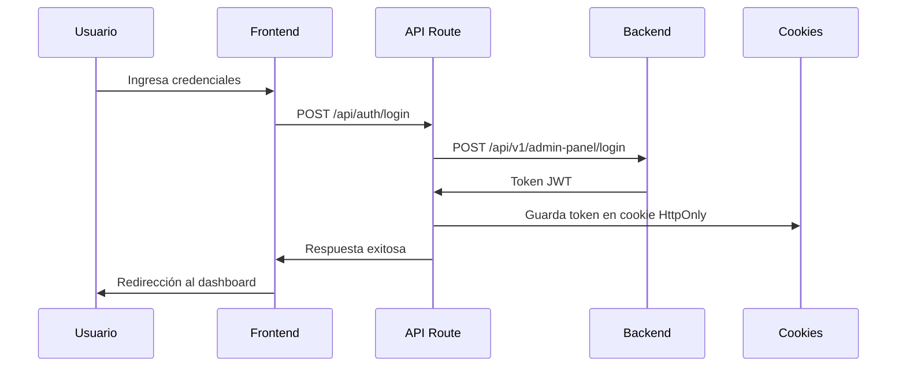
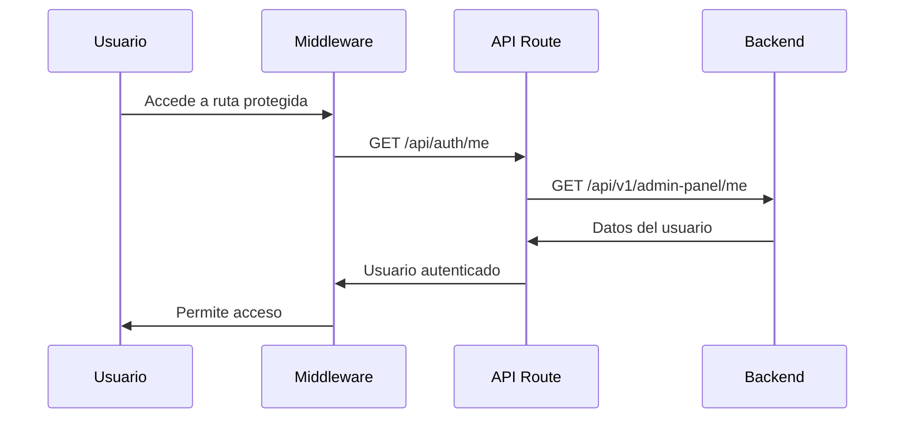
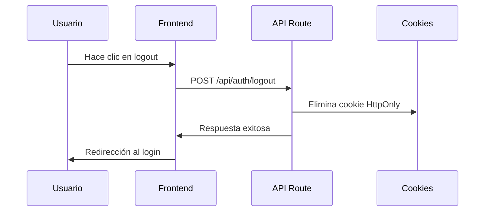

# 🚀 Guía del Desarrollador - Squat Fit Dashboard

## 📋 **Descripción General**

Este documento proporciona información técnica detallada sobre la implementación del sistema de autenticación y las decisiones arquitectónicas tomadas en el dashboard administrativo de Squat Fit.

## 🔐 **Sistema de Autenticación**

### **Arquitectura Implementada**

El sistema de autenticación sigue un patrón seguro y moderno con las siguientes características:

#### **1. Cookies HttpOnly vs localStorage**

**Decisión:** Usar cookies HttpOnly en lugar de localStorage

**Razones de Seguridad:**
- ✅ **Protección contra XSS**: Las cookies HttpOnly no son accesibles desde JavaScript
- ✅ **Transmisión Automática**: Se envían automáticamente en cada request
- ✅ **Configuración Segura**: Se pueden configurar con flags de seguridad
- ✅ **Expiración Automática**: Manejo automático de expiración por el navegador

**Implementación:**
```typescript
// src/lib/auth/cookie-utils.ts
export async function setAuthTokenInCookies(token: string) {
  const cookies = await getCookies();
  cookies.set('authToken', token, {
    httpOnly: true,
    secure: process.env.NODE_ENV === 'production',
    sameSite: 'lax',
    maxAge: 60 * 60 * 24 * 7, // 7 días
  });
}
```

#### **2. Context de Autenticación**

**Propósito:** Estado global de autenticación accesible en toda la aplicación

**Implementación:**
```typescript
// src/contexts/auth-context.tsx
export function AuthProvider({ children }: { children: React.ReactNode }) {
  const [user, setUser] = useState<User | null>(null);
  const [loading, setLoading] = useState(true);

  const login = async (email: string, password: string) => {
    // Lógica de login
  };

  const logout = async () => {
    // Lógica de logout
  };

  return (
    <AuthContext.Provider value={{ user, loading, login, logout, refreshUser }}>
      {children}
    </AuthContext.Provider>
  );
}
```

**Uso del Context:**
```typescript
// En cualquier componente
import { useAuth } from '@/contexts/auth-context';

export function MyComponent() {
  const { user, login, logout } = useAuth();
  
  if (!user) {
    return <div>No autenticado</div>;
  }
  
  return <div>Bienvenido, {user.email}</div>;
}
```

#### **3. Middleware de Protección**

**Propósito:** Protección automática de rutas sin autenticación

**Implementación:**
```typescript
// src/middleware.ts
export async function middleware(request: NextRequest) {
  const { pathname } = request.nextUrl;
  
  // Rutas públicas
  const publicRoutes = ['/auth', '/unauthorized', '/api/auth'];
  const isPublicRoute = publicRoutes.some(route => pathname.startsWith(route));
  
  if (isPublicRoute) {
    return NextResponse.next();
  }
  
  // Verificar autenticación para rutas protegidas
  const authenticated = await isAuthenticated();
  
  if (!authenticated) {
    const loginUrl = new URL('/auth/v1/login', request.url);
    loginUrl.searchParams.set('redirect', pathname);
    return NextResponse.redirect(loginUrl);
  }
  
  return NextResponse.next();
}
```

### **Flujo de Autenticación**

#### **1. Login**


#### **2. Verificación de Autenticación**


#### **3. Logout**


## 🏗️ **Arquitectura del Proyecto**

### **Estructura de Directorios**

```
src/
├── app/                    # App Router de Next.js
│   ├── (external)/        # Rutas públicas
│   ├── (main)/           # Rutas protegidas
│   │   ├── auth/         # Autenticación
│   │   └── dashboard/    # Dashboard principal
├── components/            # Componentes reutilizables
│   ├── auth/             # Componentes de autenticación
│   ├── ui/              # Componentes base de shadcn/ui
│   └── data-table/      # Componentes de tablas
├── contexts/             # Contextos de React
│   └── auth-context.tsx  # Contexto de autenticación
├── lib/                  # Utilidades y helpers
│   ├── auth/             # Utilidades de autenticación
│   └── services/         # Servicios de API
├── middleware/           # Middleware de autenticación
└── navigation/           # Configuración de navegación
```

### **Separación de Responsabilidades**

#### **1. Componentes de Autenticación**
- `LoginForm` - Formulario de login
- `AuthStatus` - Estado de autenticación
- `LogoutButton` - Botón de logout reutilizable

#### **2. Utilidades de Autenticación**
- `cookie-utils.ts` - Manejo de cookies HttpOnly
- `jwt-utils.ts` - Utilidades para JWT
- `auth-utils.ts` - Funciones de autenticación
- `auth-service.ts` - Servicio de API

#### **3. Contexto de Autenticación**
- Estado global de usuario
- Funciones de login/logout
- Manejo de loading states

## 🔧 **Configuración y Variables de Entorno**

### **Variables Requeridas**

```env
# Backend API
NEXT_PUBLIC_API_URL=https://squatfit-api-cyrc2g3zra-no.a.run.app
NEXT_PUBLIC_API_TIMEOUT=10000

# Aplicación
NEXT_PUBLIC_APP_NAME=Squat Fit Dashboard
DEFAULT_TIMEZONE=Europe/Madrid
```

### **Configuración de Cookies**

```typescript
// Configuración segura de cookies
const cookieOptions = {
  httpOnly: true,           // No accesible desde JavaScript
  secure: process.env.NODE_ENV === 'production', // Solo HTTPS en producción
  sameSite: 'lax',         // Protección CSRF
  maxAge: 60 * 60 * 24 * 7, // 7 días
  path: '/',                // Disponible en toda la app
};
```

## 🛠️ **Uso del Sistema de Autenticación**

### **1. Acceso al Contexto**

```typescript
import { useAuth } from '@/contexts/auth-context';

export function MyComponent() {
  const { user, loading, login, logout } = useAuth();
  
  if (loading) {
    return <div>Cargando...</div>;
  }
  
  if (!user) {
    return <div>No autenticado</div>;
  }
  
  return (
    <div>
      <p>Bienvenido, {user.email}</p>
      <button onClick={logout}>Cerrar sesión</button>
    </div>
  );
}
```

### **2. Protección de Rutas**

```typescript
// Las rutas se protegen automáticamente con el middleware
// No es necesario agregar lógica adicional en los componentes
```

### **3. Componentes de Autenticación**

```typescript
// LoginForm - Formulario de login
import { LoginForm } from '@/components/auth';

// AuthStatus - Estado de autenticación
import { AuthStatus } from '@/components/auth';

// LogoutButton - Botón de logout
import { LogoutButton } from '@/components/auth';
```

### **4. API Routes**

```typescript
// src/app/api/auth/login/route.ts
export async function POST(request: Request) {
  const { email, password } = await request.json();
  
  try {
    const response = await AuthService.login(email, password);
    await setAuthTokenInCookies(response.token);
    
    return NextResponse.json({ success: true });
  } catch (error) {
    return NextResponse.json(
      { error: 'Credenciales inválidas' },
      { status: 401 }
    );
  }
}
```

## 🔒 **Medidas de Seguridad Implementadas**

### **1. Cookies HttpOnly**
- ✅ No accesibles desde JavaScript
- ✅ Protección contra ataques XSS
- ✅ Transmisión automática en requests

### **2. Middleware de Protección**
- ✅ Verificación automática de autenticación
- ✅ Redirección automática al login
- ✅ Protección de todas las rutas del dashboard

### **3. Validación de Tokens**
- ✅ Verificación de expiración
- ✅ Validación de formato JWT
- ✅ Limpieza automática de tokens expirados

### **4. Manejo de Errores**
- ✅ Logout automático en errores 401
- ✅ Limpieza de estado en errores
- ✅ Redirección segura

## 🚀 **Desarrollo y Debugging**

### **1. Verificar Estado de Autenticación**

```typescript
// En cualquier componente
const { user, loading } = useAuth();
console.log('Estado de autenticación:', { user, loading });
```

### **2. Debugging del Middleware**

```typescript
// Los logs del middleware aparecen en la consola del servidor
// Verificar logs para entender el flujo de autenticación
```

### **3. Verificar Cookies**

```bash
# En las herramientas de desarrollador del navegador
# Application > Cookies > localhost
# Verificar que authToken esté presente y sea HttpOnly
```

## 📈 **Próximos Pasos de Desarrollo**

### **1. Funcionalidades Core**
- [ ] CRUD de usuarios administrativos
- [ ] Gestión de roles y permisos
- [ ] Auditoría de accesos

### **2. Mejoras de Seguridad**
- [ ] Refresh tokens
- [ ] Rate limiting
- [ ] Logging de eventos de seguridad

### **3. Funcionalidades de Negocio**
- [ ] Gestión de datos del negocio
- [ ] Reportes y analytics
- [ ] Configuración del sistema

## 🐛 **Solución de Problemas Comunes**

### **1. Error de Autenticación**
```typescript
// Verificar que el token esté presente
// Verificar que el backend esté funcionando
// Verificar las variables de entorno
```

### **2. Redirección Infinita**
```typescript
// Verificar que el middleware esté configurado correctamente
// Verificar que las rutas públicas estén definidas
```

### **3. Cookies No Persisten**
```typescript
// Verificar configuración de cookies
// Verificar que el dominio sea correcto
// Verificar flags de seguridad
```

---

**Última actualización:** $(date)
**Versión:** 1.0.0
**Responsable:** Equipo de Desarrollo 